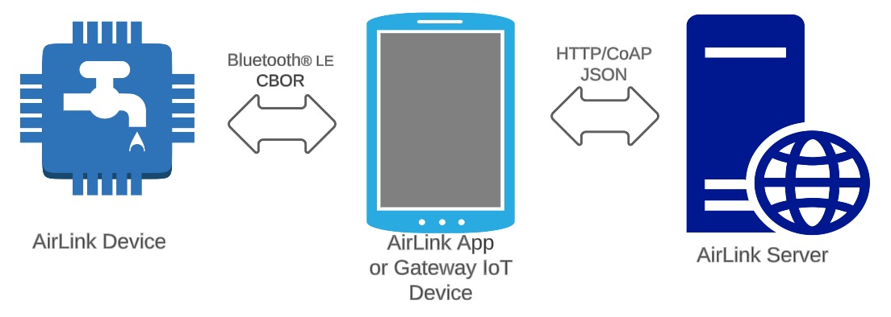
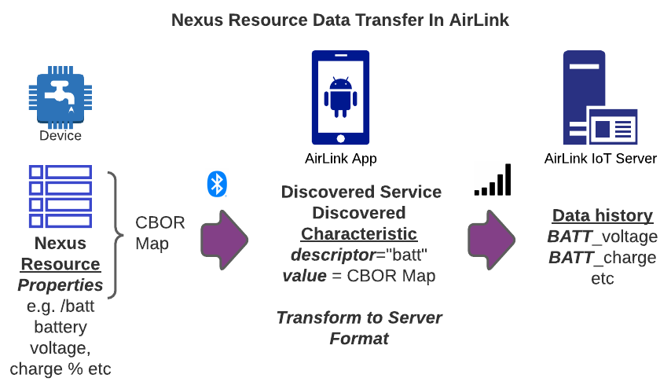
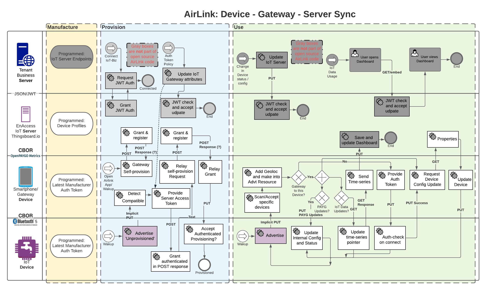
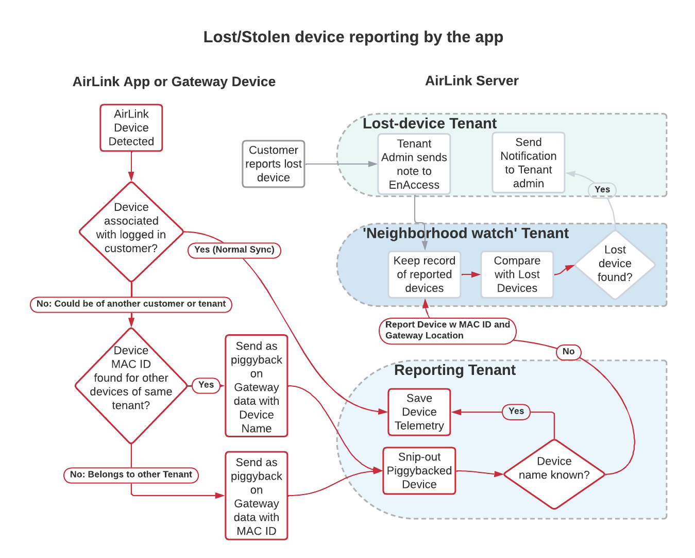

<!-- markdownlint-disable-next-line first-line-h1 -->
<p align="center">
 <a href="https://github.com/EnAccess/AirLink-Server">
  
 </a>
</p>
<p align="center">
  <em>AirLink uses financed phones as relay-extensions of the internet in remote areas, to extend productive asset data coverage in even the most rural communities. By introducing open-standards communications, AirLink allows customers’ phones and PAYGo assets to communicate with each other by using widely available, standard low-energy Bluetooth connectivity.</em>
</p>
<p align="center">
 
 <a href="https://github.com/EnAccess/AirLink-Server/blob/main/LICENSE" target="_blank">
  
 </a>
</p>

---

This is **technical documentation** for AirLink.

!!! info "AirLink"
  AirLink is an open source framework (MIT License) for Pay-As-You-Go (PAYG) IoT devices to connect to compatible servers via Bluetooth® gateways. The protocol provides an interoperable communication standard and example code for wire-free communication between PAYG devices and an IoT server using smartphones as gateways.

If you are looking for an overview of the AirLink project, the landing page is here:

- [:octicons-arrow-right-24: AirLink project page @EnAccess](https://enaccess.org/airlink/)

Here is also a helpful guide that plays through the AirLink adoption flow in short:

- [🏁 Quick-start guide](Quick-start guide.md)

---

## Use cases

*For all potential use cases, EnAccess hosts the IoT server for free so that you can try your idea quickly and cost effectively!*

Are you evaluating AirLink as:
<details>

<summary>A Device Manufacturer developing devices to be used in remote-region IoT data collection or PAYGO-financed use</summary>

### Why
AirLink saves manufacturers from the hassle of building out a custom IoT software backend for their hardware devices, and the open source format makes it likely that several adopters with different software stacks for business management can adopt AirLink devices. *This clear separation of the hardware and software stacks using the most commonly adopted ad-hoc wireless communication standard, Bluetooth®, is a key benefit of AirLink.*

### Making your Devices compatible with AirLink
Compatibility takes four simple steps focused on Advertisement and Data format, and optionally on authentication.

1. Customize the Advertisement packet to match AirLink spec, as mentioned in the [AirLink Devices](AirLink%20Devices.md) page.
2. Group similar properties e.g. tempC, maxTemp. Create a [CBOR array](https://cbor.me) with these properties. These will be transferred once the app connects to the device. Collapsing several individual properties into one CBOR Array has the added benefit of making the data transfer memory efficient and fast.
3. Name the Bluetooth® *descriptor* with the property name e.g. 'temp'. Then, AirLink will understand your properties as temp_tempC, temp_maxTemp etc and on successful sync you will find these properties in the timeseries data for that device on the server. Device configurations are also saved similarly in dcfg_* properties.
4. Optional: Build an [access control flow](#airlink-main-flows) in your devices which relies on a Server Access Token "password" unique to the device, starting with a pre-programmed value which is entered into to the firmware. Then, your device will only allow data transfer from/to a particular app which knows the default access token - and once provisioned on the server, will receive an access token *unique* to it. All device data access control will then be locked to phones that can access this unique device token from the server, based on the Role-Based Access Control functions available on the server. 

### Supplying AirLink Devices
There are three main options to having distributors or end users adopt your AirLink devices.
1. Get tenancy on the [AirLink Server](AirLink%20Server.md) and manage devices yourself, using API capabilities to interface with the software stack of the adopter. Upload devices using [CSV upload](Quick-start%20guide.md) to get them ready for the adopter's AirLink App.
2. Get tenancy on the [AirLink Server](AirLink%20Server.md) and use the built-in Angaza or Solaris integration to make your devices connect with one of those software stack, using credentials supplied by Angaza or Solaris. This means any adopter using those software stacks can use your devices, only requirement being obtaining manufacturer and/or distributor API credentials from Angaza or Solaris.
3. Send your devices to the distributor or end user with only the default access token programmed, and the distributor can then associate them with their own version of the AirLink App and their own server tenancy

For each of the cases, the only input required to the devices after [Compatibility](#making-your-devices-compatible-with-airlink) is programming the default access token. Similarly, the only step required to move devices between distributors e.g. reselling stock is to change the default access token to the one supported by the other adopter. The devices themselves are separate from any custom functionality developed in the AirLink app for each distributor/user/adopter so the AirLink Bluetooth® protocol effectively acts to insulate the devices from software stack changes.

### Bluetooth® SIG registration
If your customer will be selling the devices without changing the product name or incorporating into another product, you might need to register with the Bluetooth® SIG at your cost (or negotiate with a distributor). You only have to do this once for all your products that depend on a single Bluetooth® IC e.g. nRF81822, or the Laird BL653 etc. More details are on the [AirLink Devices](AirLink%20Devices.md) page.

---
</details>
<details>

<summary>An NGO wanting to define a adaptable hardware/software standard for data collection in your projects or grantees</summary>

### Out of the box
AirLink, after following the [Quick-Start](Quick-start%20guide.md), can synchronize data from AirLink-compatible devices to the server without any other setup. Server data and device configuration updates can be pulled from the server when in network range, and device updates and data collection from the device can be done fully offline over Bluetooth®. This can be tested using the AirLink Gateway App and AirLink Devices app as shown in the guide. 

To customize this behavior for your own data collection project, you will need to customize your Bluetooth® device firmware as well as the open-source AirLink App as below:

### Making Devices compatible with AirLink
If the devices that will serve the data you need to collect have Bluetooth® enabled, then compatibility takes four simple steps focused on Advertisement and Data format, and optionally on authentication. Please discuss these with the device manufacturer:
1. Customize the Advertisement packet to match AirLink spec, as mentioned in the [AirLink Devices](AirLink%20Devices.md) page.
2. Group similar properties e.g. tempC, maxTemp. Create a [CBOR array](https://cbor.me) with these properties. These will be transferred once the app connects to the device
3. Name the Bluetooth® *descriptor* with the property name e.g. 'temp'. Then, AirLink will understand your properties as temp_tempC, temp_maxTemp etc and on successful sync you will find these properties in the timeseries data for that device on the server. Device configurations are also saved similarly in dcfg_* properties.
4. Optional: Build an [access control flow](#airlink-main-flows) in your devices which relies on a Server Access Token "password" unique to the device, starting with a pre-programmed value which is entered into to the firmware. Then, your device will only allow data transfer from/to a particular app which knows the default access token - and once provisioned on the server, will receive an access token *unique* to it. All device data access control will then be locked to phones that can access this unique device token from the server, based on the Role-Based Access Control functions available on the server. 

### Building information ownership
Want to assign devices to certain agents? Want to ensure that they automatically pull data when in range / on a button press? Need to store access tokens for certain devices on certain agent phones? No problem! All of these can be achieved using the API access between the AirLink App and the server, and the Role Based Access Control available in thingsboard. The full documentation for the server API is live at the server's [Swagger URL](https://airlink.enaccess.org/swagger-ui.html). 

Here are some starting ideas to get your work setup. These can be either done in the Flutter app itself, or on a server running your own application stack "Your Stack".
1. Relating Agents and Devices - AirLink Server UI OR Flutter App OR Your Stack - The first step is to create a relation from the Agent or Customer, registered as a user or customer in the AirLink server, to your device. You can do this via the AirLink server UI, or API access using the "Tenant Administrator" role available in the Flutter app for demonstration, as shown below:
   UI:
   

   API:
   []()

   
2. Pulling relevant Server Access Tokens from the server for devices related to a particular app - Flutter App - The first step here is to relate each app instance to the user/customer created in Step #1. At Simusolar, we built a SMS based authentication flow for customers and an email based flow for our Staff, all using Thingsboard.io Rule Chains on the AirLink server connecting to our software stack via API. Once you have users/customers related to the app instance, the relations built in Step#1 will indirectly relate the devices to the app instance. You can then download a list of all 'Server Access Tokens' from the server for the devices that have the relevant relationship, using a query based lookup supported by the AirLink server. For this, you will need to use the "Tenant Administrator" role in the Flutter App andn access this API:
   []()

   For example, to download access tokens related to a particular customer's "Owned" devices, here is the code:
   ```
   abcd
   ```

### Using the devices and app to collect data at scale
1. Admin and Agent roles for Device initialization and Use - Flutter App - 
2. Auto-synchronizing - Flutter App - 
3. Optional: Create an Automation in your Flutter app that scans for devices, connects to them one by one and pulls data from them to make the process seamless for an Agent or user. The open-source app has the mechanism for the individual steps but leaves the process automation to you depending on your use case.

---
</details>
<details>

<summary>A Fintech entrepreneur who wants to define a unique user experience using software but need a hardware spec that's ready to go to share with a device manufacturer</summary>

---
</details>
<details>

<summary>You have an IoT idea that connects to smartphones! But you don't want to reinvent device connectivity, and would like to try something asap without having to spin up a data server etc</summary>

</details>

---

## AirLink components

- :material-radio: **AirLink devices** ([Nordic nRF](https://www.nordicsemi.com/Products/Bluetooth-Low-Energy) firmware)

  [:octicons-arrow-right-24: AirLink devices documentation](AirLink Devices.md)

  [:octicons-mark-github-16: AirLink devices on Github](https://github.com/EnAccess/AirLink-Devices)

- :octicons-device-mobile-16: **AirLink App** ([Flutter](https://flutter.dev/) app)

  [:octicons-arrow-right-24: AirLink App documentation](AirLink App.md)

  [:octicons-mark-github-16: AirLink App on Github](https://github.com/EnAccess/AirLink-App)

- :material-server: **AirLink Server** ([Thingsboard](https://thingsboard.io/) server configuration)

  [:octicons-arrow-right-24: AirLink Server documentation](AirLink Server.md)

  [:octicons-mark-github-16: AirLink Server on Github](https://github.com/EnAccess/AirLink-Server)



---

## AirLink main flows

### Data transfer flow



### App architecture



### Provisioning and Unknown device flow



---

## Related resources

- [CBOR](http://cbor.io/): Memory-efficient JSON-like data format
- [OCF](https://openconnectivity.org/developer/specifications/): Data structure standard to represent IoT devices
 
- [Nexus Channel](https://angaza.github.io/nexus-channel-models/resource_type_spec.html): Angaza's Inter-operability initiative
- [OpenPAYGO Link](https://github.com/EnAccess/OpenPAYGO-Link/tree/main/Documentation): Wired inter-operability from Solaris/EnAccess
- [OpenPAYGO Metrics](https://github.com/openpaygo/metrics): GSM inter-operability from Solaris
- [OpenPAYGO Token](https://github.com/EnAccess/OpenPAYGO-Token): Open Source PAYGO token reference design from Solaris/EnAccess

---


AirLink was developed by [Simusolar Inc](https://www.simusolar.com/) with support from [EnAccess](https://enaccess.org).
